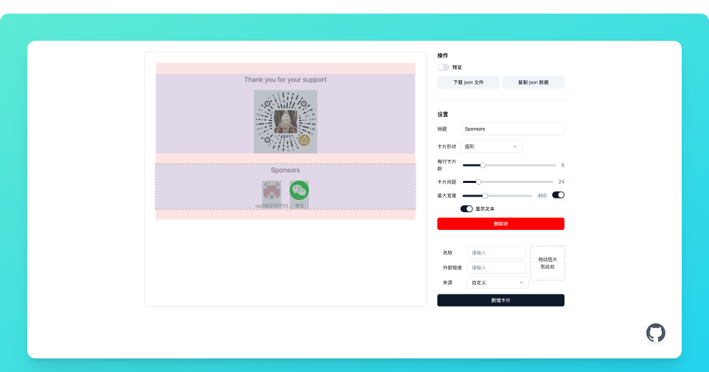

# Sponsorkit

[deploy-button-image]: https://vercel.com/button
[deploy-link]: https://vercel.com/new/clone?repository-url=https%3A%2F%2Fgithub.com%2Fltaoo%2Fsponsorkit%3Fenv%3DTOKEN&project-name=sponsorkit&repository-name=sponsorkit

受 [sponsorkit](https://github.com/antfu-collective/sponsorkit) 启发，做的一个手动维护 `sponsors` 的工具，可以在页面上编辑、新增 `sponsors`。

## 页面截图

## 部署

Deploy with Vercel

[![][deploy-button-image]][deploy-link]

> 记得环境变量加上 `TOKEN`，前端页面需要该值作为登录凭证。

## 使用方式

在页面上编辑好数据，点击「复制 json 数据」，回到自己的仓库，使用新的数据覆盖 `storage/config.json` 文件内容，重新部署即可。

> 或者有什么简单的数据存储方案可以推荐一下，最终预期效果可以是在页面上点击「保存」按扭即可生效。

## 效果预览

